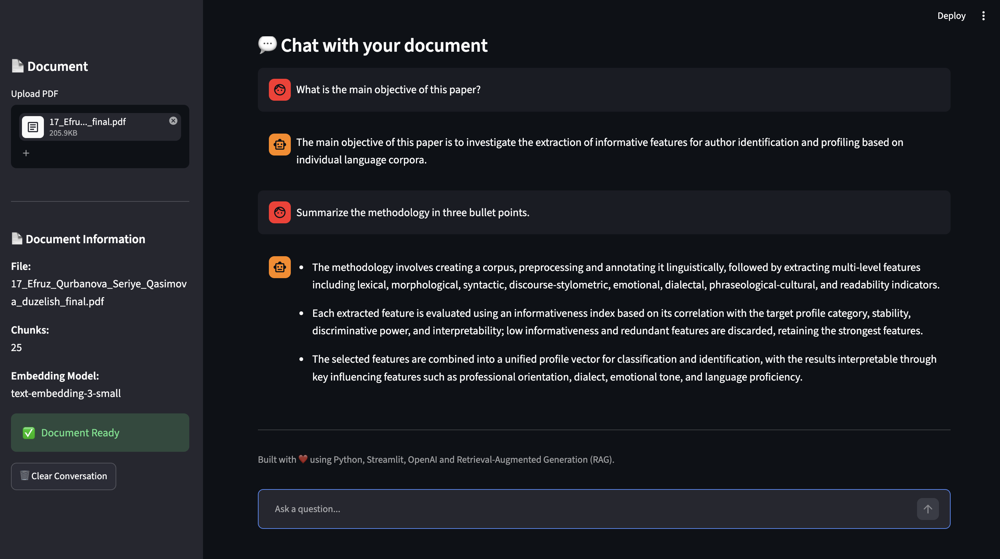

# 📚 AI Teaching Assistant (RAG)

A Retrieval-Augmented Generation (RAG) application that allows users to upload PDF documents and ask natural language questions based only on the uploaded document.

The application extracts text from PDF files, splits the content into chunks, generates OpenAI embeddings, retrieves the most relevant information using semantic search, and generates accurate answers with GPT.

---
## 📸 Application Preview



## ✨ Features

- 📄 Upload PDF documents
- ✂️ Automatic text extraction
- 🧩 Intelligent text chunking
- 🧠 OpenAI Embeddings
- 🔍 Semantic Search using Cosine Similarity
- 🤖 GPT-powered Question Answering
- 💬 Chat-style interface
- 📝 Conversation history
- ⚡ Modular RAG architecture

---

## 🏗 Architecture

```text
                PDF Document
                      │
                      ▼
               PDF Reader
                      │
                      ▼
               Text Chunking
                      │
                      ▼
          OpenAI Embeddings
                      │
                      ▼
          Semantic Retrieval
                      │
                      ▼
          Relevant Chunks
                      │
                      ▼
               GPT-4.1-mini
                      │
                      ▼
                Final Answer
```

---

## 🛠 Tech Stack

- Python
- Streamlit
- OpenAI API
- PyPDF
- Pydantic
- Python-dotenv

---

## 📂 Project Structure

```text
src/
│
├── pdf_reader.py
├── chunker.py
├── embedding_client.py
├── retriever.py
├── rag_pipeline.py
├── rag_answer.py
│
app.py
requirements.txt
README.md
```

---

## ⚙️ How It Works

1. Upload a PDF document.
2. Extract text from the document.
3. Split the text into chunks.
4. Generate embeddings for every chunk.
5. Convert the user's question into an embedding.
6. Retrieve the most relevant chunks using cosine similarity.
7. Generate the final answer with GPT-4.1-mini using only the retrieved context.

---

## 🚀 Installation

Clone the repository

```bash
git clone https://github.com/SariyaQ/ai-teaching-assistant-rag.git
```

Go to the project directory

```bash
cd ai-teaching-assistant-rag
```

Create a virtual environment

```bash
python -m venv venv
```

Activate it

macOS / Linux

```bash
source venv/bin/activate
```

Windows

```bash
venv\Scripts\activate
```

Install dependencies

```bash
pip install -r requirements.txt
```

Create a `.env` file

```text
OPENAI_API_KEY=your_api_key
```

Run the application

```bash
streamlit run app.py
```

---

## 📌 Example Questions

- What is the main objective of this paper?
- Summarize the methodology.
- What are the main contributions?
- What are the future research directions?

---

## 🚀 Future Improvements

- FAISS Vector Database
- Multi-document support
- Embedding cache
- Better chunking strategy
- Metadata filtering
- Streamlit Cloud deployment

---

## 👩‍💻 Author

**Sariya Gasimova**

AI Engineer | Lecturer | Researcher

GitHub:
https://github.com/SariyaQ

LinkedIn:
https://www.linkedin.com/in/sariya-gasimova-012b0b289/?locale=en
